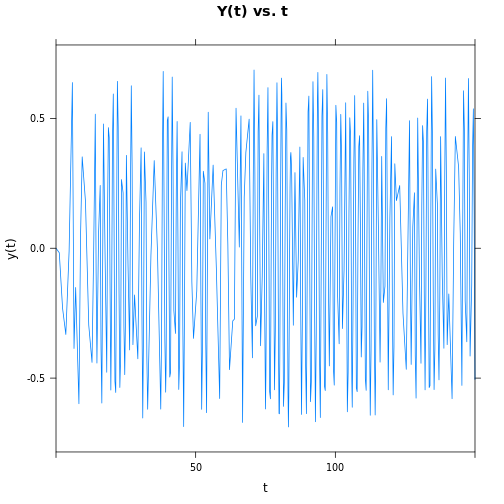

# CHUA'S CIRCUIT

## The Equations

#### dx/dt = c1*(y-x-f(x)) 
#### dy/dt = c2*(x-y+z)
#### dz/dt = -c3*y
#### f(x) = m1*x+(m0-m1)/2*(|x+1|-|x-1|)  
   
## Implementation


```r
require(mosaic)
```

```
## Loading required package: mosaic Loading required package: grid Loading
## required package: lattice
## 
## Attaching package: 'mosaic'
## 
## The following objects are masked from 'package:stats':
## 
## D, IQR, binom.test, cor, cov, fivenum, median, prop.test, sd, t.test, var
## 
## The following object is masked from 'package:base':
## 
## max, mean, min, print, prod, range, sample, sum
```


```r
c1 = 15.6
c2 = 1
c3 = 28
m1 = -1.143
m0 = -0.714

f<- function(x) {m1*x+(m0-m1)/2*(abs(x+1)-abs(x-1))}
soln <- integrateODE( dx ~ c1*(y-x-f(x)), dy ~ c2*(x-y+z),dz ~ -c3*y, x=1,y=0,z=0,tdur=150)


plotFun( soln$x(t)~t, t.lim=c(0,150),main="X(t) vs. t",xlab="t",ylab="x(t)")
```

 

```r
plotFun( soln$y(t)~t, t.lim=c(0,150),main="Y(t) vs. t",xlab="t",ylab="y(t)")
```

 

```r
plotFun( soln$z(t)~t, t.lim=c(0,150),main="Z(t) vs. t",xlab="t",ylab="z(t)")
```

 

```r

t <- seq(0,150,length=100000)
x <- soln$x(t)
y <- soln$y(t)
z <- soln$z(t)


plot(x,z,main="X vs. Z",xlab="Z",ylab="X",type="l")
```

 

```r
plot(x,y,main="X vs. Y",xlab="Y",ylab="X",type="l")
```

 

```r
plot(y,z,main="Y vs. Z",xlab="Z",ylab="Y",type="l")
```

 

```r

library(scatterplot3d)
scatterplot3d(x, y, z, highlight.3d = TRUE, col.axis = "blue",col.grid = "lightblue", pch = 20,type="l",angle = 100)
```

 

```r


manipulate(scatterplot3d(x, y, z,highlight.3d = TRUE, col.axis = "blue",col.grid = "lightblue", pch = 20,type="l",angle = a),a=slider(0,360,initial=100,label="ANGLE",step=10))
```

```
## Error: could not find function "manipulate"
```

