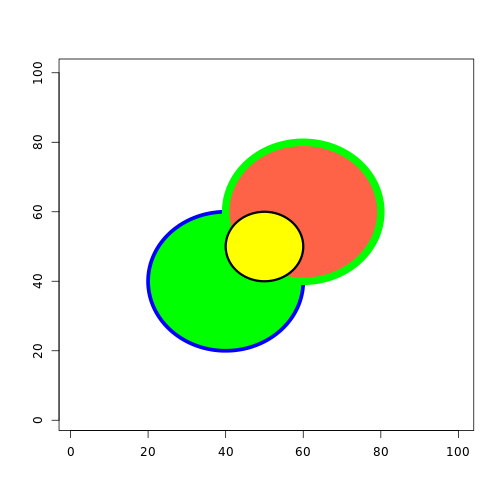
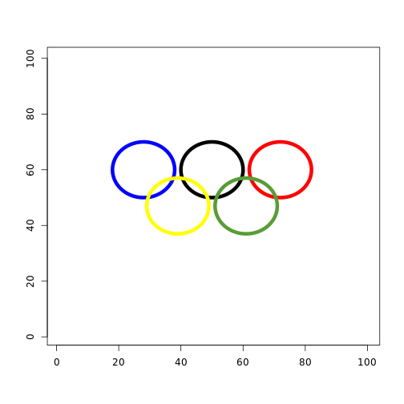

Functions and Graphics
===========

## How many are odd

```r
countOdds <- function(x) {
    return(sum(x%%2))
}
```

Test Statements:

```r
countOdds(1:9)
```

```
## [1] 5
```

```r
countOdds(c(1, 3, 7))
```

```
## [1] 3
```

```r
countOdds(c(3, 5, 7, 6, 2, 0))
```

```
## [1] 3
```


## How many are even

```r
countEvens <- function(x) {
    return(sum((x + 1)%%2))
}
```

Test Statements:

```r
countEvens(1:9)
```

```
## [1] 4
```

```r
countEvens(c(2, 4, 6, 5))
```

```
## [1] 3
```


## Pythagorus

```r
hypotenuseLength <- function(a, b) {
    return(sqrt(sum(a^2 + b^2)))
}
```

Test Statements:

```r
hypotenuseLength(3, 4)
```

```
## [1] 5
```

```r
hypotenuseLength(13, 84)
```

```
## [1] 85
```


## Law of Cosines

```r
lawOfCosines <- function(a, b, theta) {
    return(sqrt((a^2) + (b^2) - (2 * a * b * cos(theta))))
}
```

Test Statements:

```r
lawOfCosines(13, 84, pi/2)
```

```
## [1] 85
```

```r
lawOfCosines(13, 84, 0)
```

```
## [1] 71
```

```r
lawOfCosines(5, 5, pi/3)
```

```
## [1] 5
```


## Find the Angle

```r
thetaFromLengths <- function(a, b, c) {
    return(acos((c^2 - a^2 - b^2)/(-2 * a * b)))
}
```

Test Statements:

```r
thetaFromLengths(5, 5, 5)
```

```
## [1] 1.047
```

```r
thetaFromLengths(84, 13, 85)
```

```
## [1] 1.571
```


## Testing Find the Angle

```r
thetaFromLengthsTest <- function(a, b, theta) {
    return(thetaFromLengths(a, b, lawOfCosines(a, b, theta)) - theta)
}
```

Test Statements:

```r
thetaFromLengthsTest(13, 84, pi/2)
```

```
## [1] 0
```

```r
thetaFromLengthsTest(5, 5, pi/3)
```

```
## [1] 0
```


## Graphics
### Blank Canvas

```r
canvas <- function(x, y) {
    return(plot(x:y, type = "n", xlim = c(1, 100), ylim = c(1, 100), xlab = "", 
        ylab = ""))
}
```


### Circle Function

```r
drawCircle <- function(x, y, r, z) {
    return(polygon(x + r * cos(seq(0, 2 * pi, length = 1000)), y + r * sin(seq(0, 
        2 * pi, length = 1000)), border = "NA", col = z))
}
```


### Circle ... Function

```r
drawCircle <- function(x, y, r, ...) {
    return(polygon(x + r * cos(seq(0, 2 * pi, length = 1000)), y + r * sin(seq(0, 
        2 * pi, length = 1000)), ...))
}
```


### Overlapping Circles

```r

canvas(1, 2)
drawCircle(40, 40, 20, col = "green", border = "blue", lwd = 5)
drawCircle(60, 60, 20, col = "tomato", border = "green", lwd = 10)
drawCircle(50, 50, 10, col = "yellow", border = "black", lwd = 3)
```

 


### Olympic Rings

```r

canvas(1, 2)
drawCircle(50, 60, 10, col = "NA", border = "black", lwd = 6)
drawCircle(28, 60, 10, col = "NA", border = "blue", lwd = 6)
drawCircle(72, 60, 10, col = "NA", border = "red", lwd = 6)
drawCircle(39, 47, 10, col = "NA", border = "yellow", lwd = 6)
drawCircle(61, 47, 10, col = "NA", border = "green", lwd = 6)
```

 

