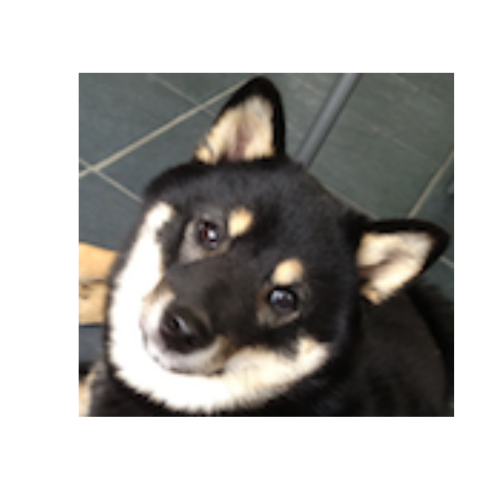

# Cropping and Framing Images


```r
require(devtools)
```

```
## Loading required package: devtools
```

```r
install_url("http://dtkaplan.github.io/ScientificComputing/Resources/COMP121_0.1.tar.gz")
```

```
## Downloading COMP121_0.1.tar.gz from
## http://dtkaplan.github.io/ScientificComputing/Resources/COMP121_0.1.tar.gz
## Installing package from /tmp/RtmpKD9Ydo/COMP121_0.1.tar.gz Installing
## COMP121 '/usr/lib/R/bin/R' --vanilla CMD INSTALL '/tmp/RtmpKD9Ydo/COMP121'
## \ --library='/home/aweberg/R/x86_64-pc-linux-gnu-library/3.0' \
## --with-keep.source --install-tests
```

```r
require(COMP121)
```

```
## Loading required package: COMP121 Loading required package: jpeg Loading
## required package: png Loading required package: RCurl Loading required
## package: bitops Loading required package: markdown
```

```r
puppy <- readPNG(getURLContent("http://dtkaplan.github.io/ScientificComputing/Resources/Images/mindo.png"))
dim(puppy)
```

```
## [1] 198 216   4
```


## Cropping Tasks

```r
canvas(x = c(1, 216), y = c(1, 198), asp = 1)
rasterImage(puppy, 1, 1, 216, 198)
```

 

#### Cropping of Face

```r
canvas(x = c(1, 216), y = c(1, 198), asp = 1)
face <- puppy[1:120, 80:210, ]
rasterImage(face, 1, 1, 216, 198)
```

 

#### Cropping of Paw

```r
canvas(x = c(1, 216), y = c(1, 198), asp = 1)
paw <- puppy[160:198, 1:60, ]
rasterImage(paw, 1, 1, 3 * 60, 3 * 38)
```

 

#### Cropping of Tag

```r
canvas(x = c(1, 216), y = c(1, 198), asp = 1)
tag <- puppy[120:140, 100:120, ]
rasterImage(tag, 1, 1, 120, 120)
```

 


## Working on a Single Plane

```r

red <- puppy[, , 1]
pair <- cbind(red, red)
framed <- cbind(red[, rev(1:20)], red, red[, rev(197:216)])
canvas(x = c(1, 40 + 216), y = c(1, 198), asp = 1)
all4 <- rbind(framed[rev(1:20), ], framed, framed[rev(179:198), ])
rasterImage(all4, 1, 1, 40 + 216, 40 + 198)
```

 


```r
canvas(x = c(1, 240), y = c(1, 240), asp = 1)
brighten <- function(photo, base) {
    a <- base + (1 - base) * photo
    b <- dim(photo)
    return(rasterImage(a, 1, 1, b[1], b[2]))
}
brighten(puppy, 0.75)
```

 


```r
croppedimage <- function(image, rows, columns, planes = NULL) {
    return(image[rows[1]:rows[2], columns[1]:columns[2], ])
}
showimage <- function(photo) {
    s <- dim(photo)
    COMP121::canvas(x = c(1, s[2]), y = c(1, s[1]), asp = 1)
    rasterImage(photo, 1, 1, s[2], s[1])
}
```


```r
brighten <- function(photo, base = 0.5) {
    b <- base + (1 - base) * photo
    return(b)
}


framing <- function(photo, width = 20) {
    s <- dim(photo)
    framed <- cbind(brighten(photo[, rev(1:width)]), photo, brighten(photo[, 
        (s[2]:(1 + s[2] - width))]))
    all4 <- rbind(brighten(framed[rev(1:width), ]), framed, brighten(framed[s[1]:(1 + 
        s[1] - width), ]))
    showimage(all4)
}

framing(puppy[, , 3], width = 20)
```

 


```r
kane <- readJPEG(getURLContent("http://www.thes4p.com/wp-content/uploads/2013/06/patrick-kane.jpg"))
framing(kane[, , 3], width = 40)
```

 


# More Framing Tasks

```r
brighten <- function(photo, base = 0.5) {
    b <- base + (1 - base) * photo
    return(b)
}

ColoredFrame <- function(photo, width = 20, Neg = F, closetoBlue = F) {
    s <- dim(photo)
    array <- array(dim = c(2 * width + s[1], 2 * width + s[2], 3))
    for (k in 1:3) {
        if ((k == 1) & (closetoBlue)) {
            image <- photo[, , k]
            framed <- cbind(brighten(image[, rev(1:width)]), image, brighten(image[, 
                (s[2]:(1 + s[2] - width))]))
            all4 <- rbind(brighten(framed[rev(1:width), ]), framed, brighten(framed[s[1]:(1 + 
                s[1] - width), ]))
        } else {
            
            image <- photo[, , k]
            framed <- cbind(image[, rev(1:width)], image, image[, (s[2]:(1 + 
                s[2] - width))])
            all4 <- rbind(framed[rev(1:width), ], framed, framed[s[1]:(1 + s[1] - 
                width), ])
            array[, , k] <- all4
        }
    }
    showimage(array)
}
```


```r
ColoredFrame(kane[, , 3], width = 20, Neg = F, closetoBlue = F)
```

```
## Error: incorrect number of dimensions
```


