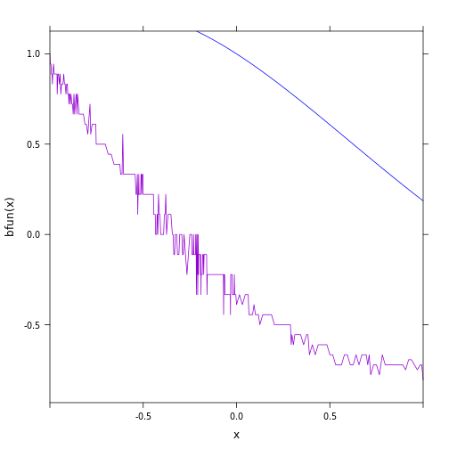
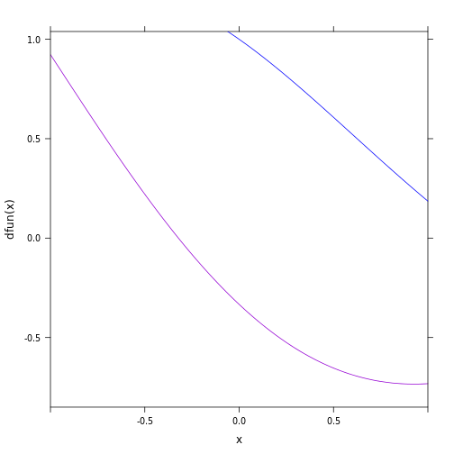

Computing Numerical Derivatives
========

## Task I


My function: $f(x) = e^{-x/3} \ cos(x)$

Implementation:

```r
f <- function(x) {
    exp(-x/3) * cos(x)
}

Df <- D(exp(-x/3) * cos(x) ~ x)

evalD <- function(f, x) {
    h <- 1e-08
    return((f(x + h) - f(x - h))/(2 * h))
}
i <- function(x) {
    evalD(f, x)
}
j <- function(x) {
    Df(x)
}
plotFun(i(x) ~ x, x.lim = range(-1e-08, 1e-08), col = "green")
plotFun(j(x) ~ x, x.lim = range(-1e-08, 1e-08), col = "blue", add = TRUE)
```

 

```r

plotFun(i(x) - j(x) ~ x, add = FALSE, x.lim = range(-1e-08, 1e-08), col = "red")
```

 

This is clearly a good approximation since the difference between the functions is close to zero for most $x$.


## Task II


```r
f <- function(x) {
    exp(-x/3) * cos(x)
}

evalD2 <- function(f, x, h = 1e-08) {
    return(function(x) {
        (f(x + h) - f(x - h))/(2 * h)
    })
}
afun <- evalD2(f, h = 1e-20)
bfun <- evalD2(f, h = 1e-15)
cfun <- evalD2(f, h = 1e-10)
dfun <- evalD2(f, h = 1e-05)
efun <- evalD2(f, h = 0.1)
ffun <- evalD2(f, h = 1)

Df <- D(exp(-x/3) * sin(x) ~ x)
j <- function(x) {
    Df(x)
}
```


```r
plotFun(afun(x) ~ x, add = FALSE, x.lim = range(-1, 1), col = "darkviolet")
plotFun(j(x) ~ x, add = TRUE, col = "blue")
```

 


```r
plotFun(bfun(x) ~ x, add = FALSE, x.lim = range(-1, 1), col = "darkviolet")
plotFun(j(x) ~ x, add = TRUE, col = "blue")
```

 


```r
plotFun(cfun(x) ~ x, add = FALSE, x.lim = range(-1, 1), col = "darkviolet")
plotFun(j(x) ~ x, add = TRUE, col = "blue")
```

 


```r
plotFun(dfun(x) ~ x, add = FALSE, x.lim = range(-1, 1), col = "darkviolet")
plotFun(j(x) ~ x, add = TRUE, col = "blue")
```

 


```r
plotFun(efun(x) ~ x, add = FALSE, x.lim = range(-1, 1), col = "darkviolet")
plotFun(j(x) ~ x, add = TRUE, col = "blue")
```

 


```r
plotFun(ffun(x) ~ x, add = FALSE, x.lim = range(-1, 1), col = "darkviolet")
plotFun(j(x) ~ x, add = TRUE, col = "blue")
```

 


Clearly 1 is the best value for h.


## Task III

```r
evalD3 <- function(f, x) {
    h <- 1e-08 * abs(x)
    return((f(x + h) - f(x - h))/(2 * h))
}
evalD3fun <- function(x) {
    evalD3(f, x)
}
plotFun(evalD3fun(x) ~ x, x.lim = range(-1, 1), add = FALSE, col = "darkviolet")
plotFun(j(x) ~ x, add = TRUE, col = "blue")
```

 


```r
evalD4 <- function(f, x) {
    h <- 1e-08 * pmax(1, abs(x))
    return((f(x + h) - f(x - h))/(2 * h))
}

evalD4fun <- function(x) {
    evalD4(f, x)
}
plotFun(evalD4fun(x) ~ x, x.lim = range(-1, 1), add = FALSE, col = "darkviolet")
plotFun(j(x) ~ x, add = TRUE, col = "blue")
```

 


Since h= 1e-8*abs(x) for evalD3, the derivatives for x values of zero and lower will not be computed.


## Task IV

```r
myD <- function(f, h = 1e-08) {
    return(function(x) evalD2(f, x, h = h))
}

myD(sin)
```

```
## function(x) evalD2(f, x, h = h)
## <environment: 0x2b321a8>
```

myD() clearly returns a function.


## Task V
Second derivative:

```r
myD2 <- function(f, h) {
    a <- myD(f, h = h)
    b <- myD(a, h = h)
    return(b)
}
```

Third derivative:

```r
myD3 <- function(f, h) {
    a <- myD(f, h = h)
    b <- myD(a, h = h)
    return(myD(b, h = h))
}


g20 <- myD2(f, 0.001)
g30 <- myD3(f, 0.001)

plotFun(g20(x) ~ x, x.lim = c(0, 10), col = "red")
```

```
## Error: object of type 'closure' is not subsettable
```

```r
plotFun(g30(x) ~ x, x.lim = c(0, 10), col = "blue", add = TRUE)
```

```
## Error: Viewport 'plot_01.panel.1.1.vp' was not found
```

 

```r


SecondD <- D(exp(-x/5) * sin(x) ~ x & x)
plotFun(g20(x) ~ x, x.lim = c(0, 10), col = "red")
```

```
## Error: object of type 'closure' is not subsettable
```

```r
plotFun(SecondD(x) ~ x, x.lim = c(0, 10), col = "blue", add = TRUE)
```

```
## Error: Viewport 'plot_01.panel.1.1.vp' was not found
```


```r
ThirdD <- D(exp(-x/5) * sin(x) ~ x & x & x)
plotFun(g30(x) ~ x, x.lim = c(0, 10), col = "red")
```

```
## Error: object of type 'closure' is not subsettable
```

```r
plotFun(ThirdD(x) ~ x, x.lim = c(0, 10), col = "blue", add = TRUE)
```

```
## Error: Viewport 'plot_01.panel.1.1.vp' was not found
```


```r

evalD3 <- function(f, x, h) {
    return((f(x + h) - 2 * f(x) + f(x - h))/(h^2))
}
myD4 <- function(f, h = 1e-05) {
    return(function(x) evalD3(f, x, h = h))
}

g50 <- myD4(f, 1e-05)
plotFun(g50(x) ~ x, x.lim = c(0, 10), col = "red")
```

 

