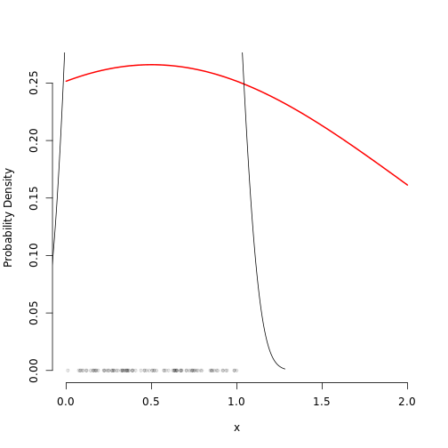

November 14
========


```r
drawDistribution <- function(fun = dbeta, param1 = 1, param2 = 0.5, xlim = c(0, 
    1), xdata = NULL) {
    x <- seq(xlim[1], xlim[2], length = 200)
    y <- fun(x, param1, param2)
    # Get rid of points not in the domain of the distribution
    keep <- is.finite(y)
    y <- y[keep]
    x <- x[keep]
    plot(x, y, type = "l", xlim = xlim, lwd = 2, col = "red", ylim = c(0, max(y)), 
        ylab = "Probability Density", xlab = "x", bty = "n")
    if (!is.null(xdata)) {
        points(xdata, rep(0, length(xdata)), pch = 20, col = rgb(0, 0, 0, 0.1))
        dens <- density(xdata)
        lines(dens$x, dens$y)
    }
}

drawDistribution(dnorm, 0.5, 1.5, xdata = runif(100), xlim = c(0, 2))
```

 


```r

myUI <- div(div(class = "jumbotron masthead", h3("The β Distribution"), p("Showing the shape of the β distribution."), 
    actionButton(inputId = "submitted", "Send in your parameters.")), div(class = "row span9 well", 
    div(class = "span3 well", selectInput("distDistrib", "Choice of Distribution", 
        list(uniform = "uniform", gaussian = "normal", beta = "beta", `chi squared` = "chisq"), 
        selected = "beta"), sliderInput("distParam1", "Parameter 1", min = 0.01, 
        max = 2, step = 0.01, value = 0.5), sliderInput("distParam2", "Parameter 2", 
        min = 0.01, max = 2, step = 0.01, value = 0.1)), div(class = "span4 well", 
        plotOutput("distPlot1"), sliderInput("distXrange", "X-axis Range", min = -10, 
            max = 10, step = 0.5, value = c(0, 1)))))
```

```
## Error: could not find function "div"
```

